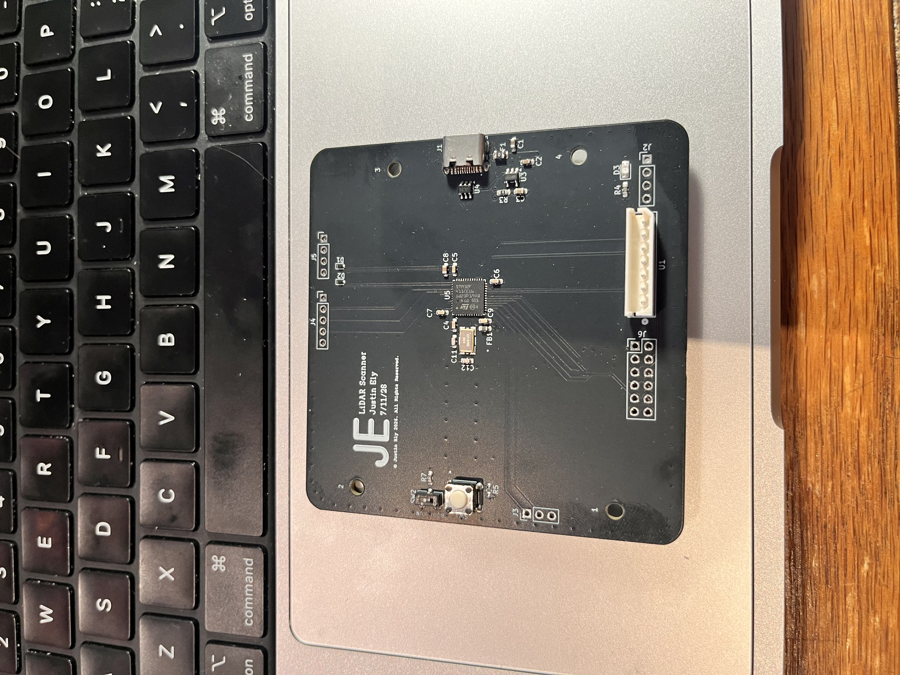
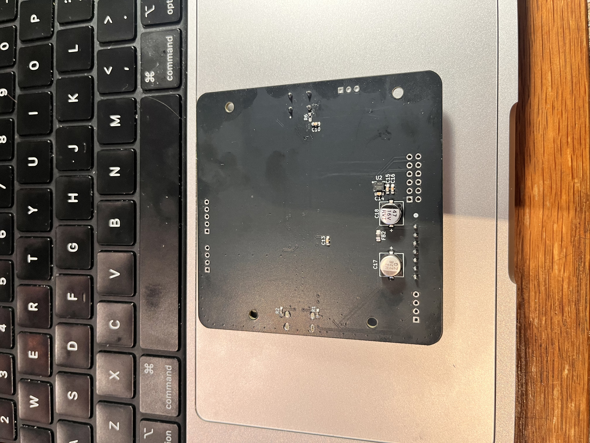
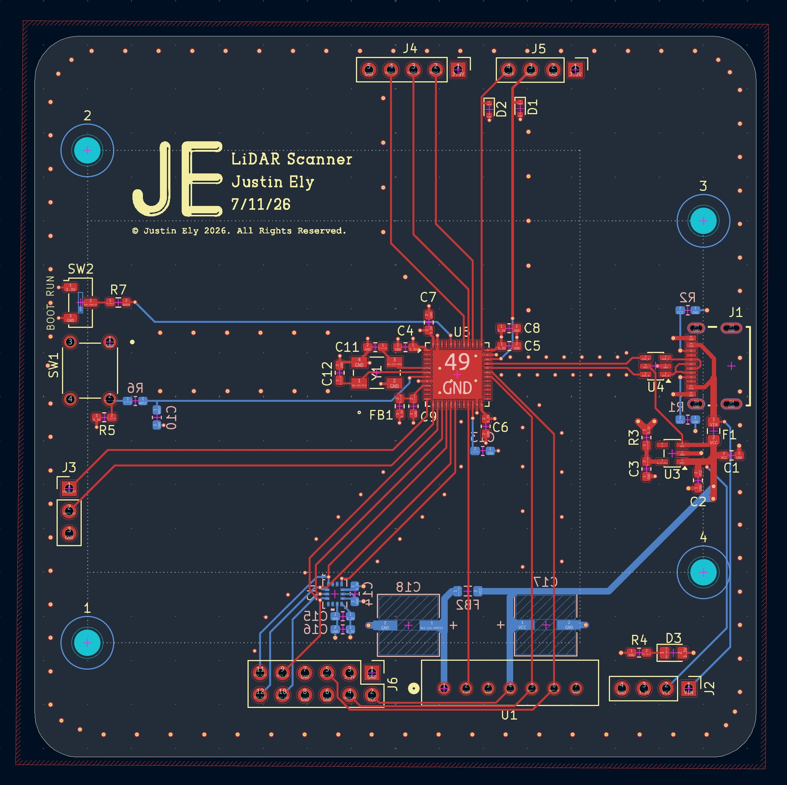
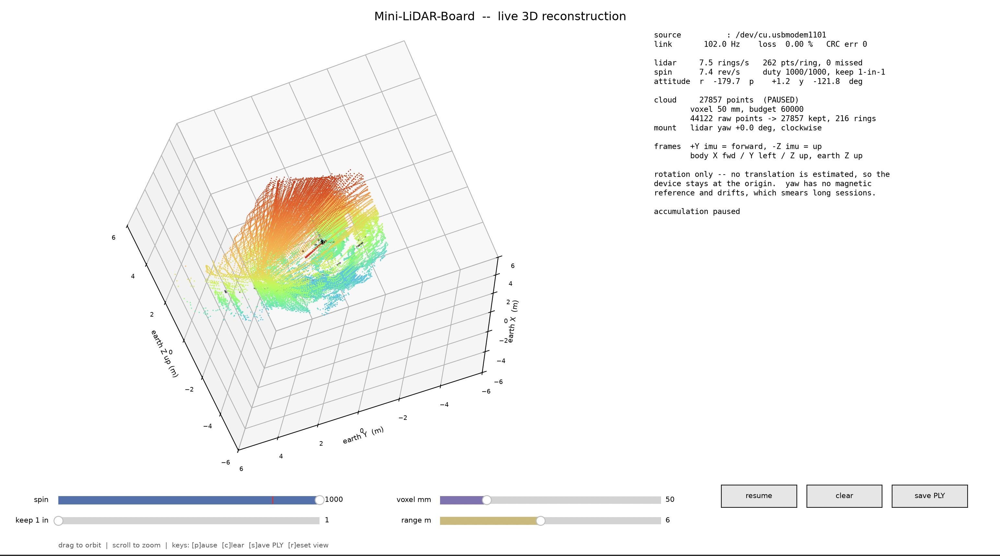

# Mini-LiDAR-Board

A handheld 3D LiDAR scanner built on a custom 4-layer PCB. An STM32F411 fuses
an on-board IMU with an RPLIDAR A1 to reconstruct the room around it in real
time — hardware, firmware, and host software all in this repository.


---

## What it does

The board spins a LiDAR module that measures distances in a 2D plane. On its
own that only ever produces a flat ring. The on-board IMU tracks how the board
is *oriented*, so every distance reading can be rotated out of the sensor's 2D
plane and into a fixed world frame. Tilt and sweep the unit by hand and the
flat rings stack into a 3D point cloud of the room.

```
 IMU  ──SPI+DMA──▶  Madgwick filter  ──▶  quaternion  ─┐
                                                       ├──▶  USB CDC  ──▶  host  ──▶  3D point cloud
 LiDAR ──UART+DMA──▶  node parser  ──▶  one revolution ─┘
```

Three things had to work together: a board clean enough to run a 96 MHz MCU and
USB next to a sensitive MEMS sensor, firmware fast enough to service a 1 kHz IMU
and a continuous LiDAR stream at once, and host software that gets the coordinate
frames right.

---

## Hardware

Designed in KiCad, fabricated and assembled, brought up and validated.

| | |
|---|---|
| **Board** | 4-layer, 82 × 82 mm, 49 components, 212 vias |
| **Stackup** | `F.Cu` signal · `In1.Cu` GND plane · `In2.Cu` VDD plane · `B.Cu` signal |
| **Design rules** | 0.15 mm clearance, 0.45 mm via / 0.2 mm drill |
| **MCU** | STM32F411CEU6 — QFN-48, 7 × 7 mm, 0.5 mm pitch, 96 MHz |
| **IMU** | TDK ICM-42688-P — LGA-14, 2.5 × 3 mm, on SPI1 |
| **LiDAR** | Slamtec RPLIDAR A1 — UART @ 115200, PWM-driven spindle |
| **Power** | USB-C in, AP2112K-3.3 LDO, 5 V and 3.3 V rails |
| **Protection** | USBLC6-2SC6 TVS array, ESD diodes, resettable polyfuse |
| **Clock** | 8 MHz ABM3B crystal → 96 MHz core + exact 48 MHz USB |








A few decisions worth calling out, because they shaped the firmware:

- **The IMU is mounted on the bottom copper**, rotated −90°. That is why the
  board reads roll ≈ −180° lying flat, and why the host applies a fixed
  sensor-to-body rotation.
- **There are no GPIO-controlled LEDs.** D3 is hardwired across the 3.3 V rail
  and the MCU cannot touch it. All status therefore travels over the USB link
  or out the three debug pins on header J4 — there is no blink code anywhere.
- **The LiDAR motor supply is permanently on** through ferrite bead FB2, with no
  enable GPIO, so PWM duty is the only spindle control available.
- **PA9 carries the LiDAR UART**, not USB VBUS sense. The firmware must set
  `GCCFG.NOVBUSSENS` or the device never enumerates.

Gerbers, drill files, and the pick-and-place package are in
[`production/`](production/).

---

## Firmware

Register-level bare-metal C. No vendor HAL, no RTOS, no CubeMX — 5,139 lines
across 16 files compiling to a **12 KB flash image**.

- 96 MHz core from the 8 MHz crystal, with the exact 48 MHz PLLQ that USB needs
- ICM-42688-P at 1 kHz over SPI1 with DMA, triggered by its data-ready interrupt
- 6-DOF Madgwick fusion at the full sample rate, with startup gyro-bias calibration
- RPLIDAR A1 `SCAN` decoding off USART1 with circular DMA and byte-level resync
- TIM2_CH3 PWM spindle control
- A USB CDC-ACM device stack written directly against the OTG_FS registers
- CRC-16 framed binary protocol, hardware watchdog, and independent stall
  detection for the IMU, the LiDAR link, and the spindle

Full detail in [`firmware/README.md`](firmware/README.md),
[`firmware/HARDWARE.md`](firmware/HARDWARE.md), and the wire format in
[`firmware/PROTOCOL.md`](firmware/PROTOCOL.md).

### Build and flash

Requires `arm-none-eabi-gcc` and `st-flash` (from stlink-tools).

```bash
cd firmware
make            # builds build/lidar-imu.bin and prints section sizes
make flash      # writes it over SWD
```

---

## Host software

Python 3 with NumPy and matplotlib. Reads the USB CDC stream, parses the binary
protocol, and renders three views.

```bash
cd host
python3 -m pip install -r requirements.txt

python3 -m lidarscan              # live orientation + LiDAR rings
python3 -m lidarscan --cloud      # 3D point cloud, device fixed at the origin
python3 -m lidarscan --cloud-ins  # 3D point cloud with dead-reckoned position
python3 -m lidarscan --sim        # synthetic data, no hardware needed
python3 -m lidarscan --selftest   # 60 self-tests covering the transform chain
```

`--cloud` assumes the device only rotates in place. `--cloud-ins` additionally
double-integrates the accelerometer to estimate translation — see
[`host/lidarscan/cloud_ins.py`](host/lidarscan/cloud_ins.py) for the error budget
and why it drifts. Both write binary PLY that opens in MeshLab, CloudCompare, or
Blender.



### Coordinate frames

Getting these straight is most of the work:

| Frame | Definition |
|---|---|
| **Sensor** | Raw ICM-42688-P axes. What the Madgwick filter integrates. |
| **Body** | The board: X forward, Y left, Z up. `+Y` sensor is forward, `−Z` sensor is up. |
| **Earth** | Madgwick's output frame, Z up. Yaw has no absolute reference. |
| **LiDAR** | The A1's scan plane, related to the body frame by its physical mounting. |

The A1 is a separate module on a cable, so its orientation relative to the PCB
is mechanical and cannot be known from code. `--lidar-yaw-deg` aligns forward and
`--lidar-ccw` un-mirrors the sweep; set them once for your mounting.

---

## Repository layout

```
firmware/          bare-metal STM32F411 firmware
  src/             16 C source files
  include/         headers, incl. board.h — the authoritative pin map
  cmsis/           vendored ARM CMSIS headers
  PROTOCOL.md      normative wire format
  HARDWARE.md      pin map, DMA allocation, link budget
host/
  lidarscan/       Python host application
    protocol.py    framing, CRC, packet encode/decode
    reader.py      serial + simulated sources
    viz.py         orientation and ring views
    cloud.py       3D reconstruction, rotation only
    cloud_ins.py   3D reconstruction with dead reckoning
production/        gerbers, drill, pick-and-place
docs/images/       photos and screenshots for this README
*.kicad_*          schematic and PCB source
```

---

## Status and known limitations

Working end to end: the board is fabricated, assembled, and validated driving
the IMU, LiDAR, and USB concurrently at 0.00% measured packet loss and 5.6 rev/s
sustained scanning.

Known limits, all understood rather than mysterious:

- **Yaw drifts.** A 6-DOF filter has no magnetic reference, so long sessions
  smear the cloud about the vertical axis. Sweep and look; don't leave it
  accumulating for ten minutes and expect crisp walls.
- **`--cloud-ins` position drifts as t².** Double integration of a MEMS
  accelerometer diverges; zero-velocity updates and bias tracking bound it but
  cannot repeal it. Pause frequently while scanning.
- **Orientation packets are decimated 10:1 without an anti-alias filter**, so
  vibration above 50 Hz aliases into the band the dead-reckoner integrates.
  Averaging the samples in firmware would fix it.
- **The −90° IMU mounting rotation is not separately calibrated** — only the
  Z-flip is handled, via the stated sensor-to-body convention.

---

## License

Not yet specified.
